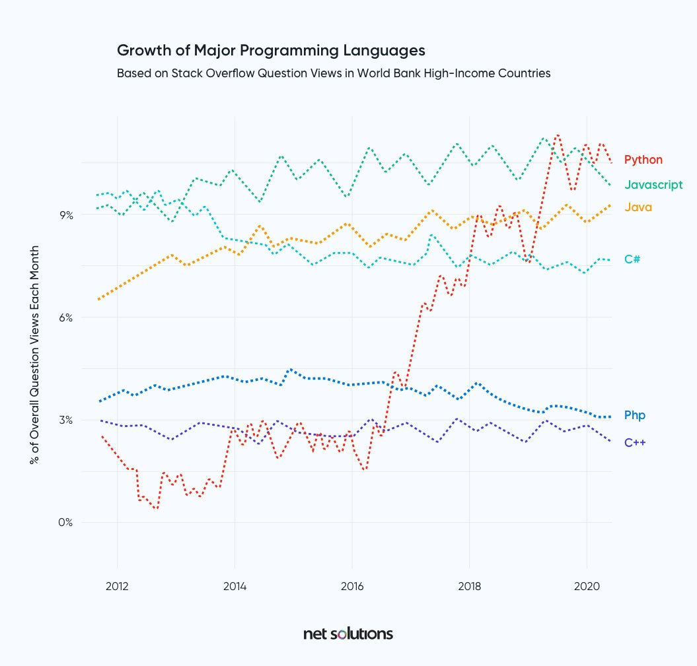
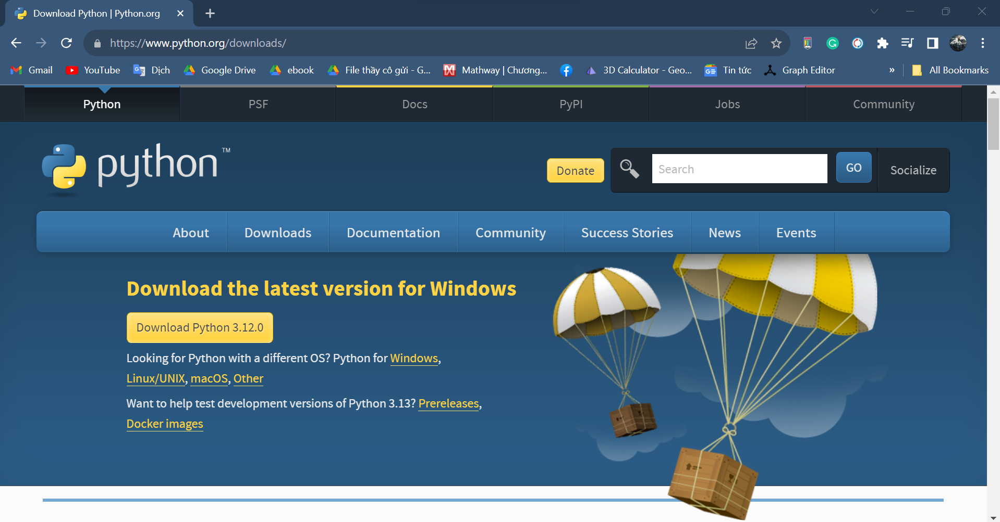

# A Taste of Py

## I. Why Python?
One reason, not necessarily the most important, is popularity: 
- The **fastest-growing** major programming language
- The **most popular programming languages** in 2022 
- The most popular programming languages for computer science courses at the **top
American colleges**


More recently, it’s become extremely popular in the data science and artificial intelligence (AI) worlds.

But *why* is it popular?

Python is a high-level language that is great for many purposes. Its design prioritizes readability, which is more important than you might think. Computer programs are written once but read and reviewed multiple times, often by different people. Python's readability makes it easier to learn and remember, making it more practical. Let's compare it with other programming languages using a simple shell program to better understand why.
```
#!/bin/sh
language=0
echo "Language $language: I am the shell. So there."
```
If you saved this in a file as test.sh and ran it with sh test.sh, you would see the following on your display:
```
Language 0: I am the shell. So there.
```

##### C and C++ 
They are low-level languages, used when speed is the most important. Your operating system and many of its programs (including the python
program on your computer) are probably written in C or C++.
Here's a little C program: 
```
#include <stdio.h>
int main(int argc, char *argv[]) {
int language = 1;
printf("Language %d: I am C! See? Si!\n", language);
return 0;
}
```

C++ quite similar to C but has envolved some distintive features: 
```
#include <iostream>
using namespace std;
int main() {
int language = 2;
cout << "Language " << language << \
": I am C++! Pay no attention to my little brother!" << \
endl;
return(0);
}
```

##### Java and C# 
They are successors to C and C++ that avoid some of their forebears’ problems especially memory management—but can be somewhat verbose
```
public class Anecdote {
    public static void main (String[] args) {
        int language = 3;
        System.out.format("Language %d: I am Java! So there!\n", language);
    }
}
```

C, C++, and Java are examples of **static languages**. They require you to specify some low-level details like data types for the computer (The later course will describle about definition of data types). In contrast, **dynamic languages** (also called *scripting languages*) do not force you to declare variable types before using them.

##### Perl
Perl was an all-purpose dynamic language for many years which is very powerful and has extensive libraries. Yet, its syntax can be awkward, and the language seems to have lost momentum in the past few years compare to Python and Ruby.

```
my $language = 4;
print "Language $language: I am Perl, the camel of languages.\n";
```

##### Ruby 
Ruby is a more recent language. It borrows a little from Perl, and is popular mostly because of Ruby on Rails, a web development framework. Python and this language are used in similar areas. The choice between the two depends on personal preference and the availability of libraries for the specific application.
```
language = 5
puts "Language #{language}: I am Ruby, ready and aglow."
```

##### PHP 
PHP is very popular for web development because it makes it easy to combine HTML and code. Despite its popularity on the web, PHP has limitations and has not gained widespread usage as a general language.
```
<?PHP
$language = 6;
echo "Language $language: I am PHP, a language and palindrome.\n";
?>
```

##### Go (Golang)
Go is a statically typed, compiled high-level programming language designed at Google which tries to be both efficient and friendly. 
```
package main
import "fmt"
func main() {
    language := 7
    fmt.Printf("Language %d: Hey, ho, let's Go!\n", language)
}
```


Who’s left? Oh yes, **Python**:
```
language = 9
print(f"Language {language}: I am Python. What's for supper?")
```

Python is a language that allows you to write shorter programs compared to static languages. Researchers discovered that programmers write approximately the same amount of code daily, regardless of the programming language they utilize. Therefore, if you can reduce the lines of code in half, you can double your productivity. This is why many companies consider Python to be an important tool.

And of course, Python is free, as in beer (price) and speech (liberty). Write anything you want with Python, and use it anywhere, freely.

Maybe the best reason to use Python is because people tend to enjoy programming with it, rather than seeing it as a necessary task. It doesn't hinder the process and is often described as fitting well with the way programmers think. Many developers express missing certain design aspects of Python when they have to work with other programming languages. This sets Python apart from most other languages.


## II. Why not Python?
Python isn’t the best language for every situation.

It is not installed everywhere by default. (The install Python process will be shown later)

It’s fast enough for most applications, but it might not be fast enough for some of the more demanding ones.  a program written in C, C++, C#, Java, Rust, or Go will generally run faster than its Python equivalent. But not always!


## III. Python 2 vs Python 3
The two major versions of Python that were introduced to the world were Python 2 and Python 3.

##### What is Python 2?
Python 2.0 was introduced to the tech world in the year 2000. Created by the BeOpen Python Labs team, the purpose of the introduction of Python 2 was to make programming simple and easy to learn for the common masses.

Python 2 was successful in implementing the technical details of the Python Enhancement Proposal (PEP). However, after the introduction of Python 3, Python 2 could not find a lot of its usage in the tech world and the year 2020 marked the end of Python 2’s legacy with Python 2.7 being its latest version.


##### What is Python 3?
Python 3 was released in 2008. It was not just an update of Python 2. The main goal of Python 3 was to remove redundancy in coding by getting rid of repetitive code. It also aimed to solve the problems that new programmers often encounter when learning a programming language.


##### Python 2 or 3: Which Python Version is Best?
It is definitely Python 3 that is the victorious version.

Python 3 surpasses Python 2 in terms of readability, comprehension, and popularity. Python 2 is outdated and only worth studying if you come across old code or if a company requires you to migrate Python 2 code to Python 3.


## IV. Install Standard Python 
Go to the official Python [download page](https://www.python.org/downloads) with your web browser. It tries to guess your operating system and present the appropriate choices, but if it guesses wrong, you can use these:
- [Python Releases for Windows](https://www.python.org/downloads/windows/)
- [Python Releases for macOS](https://www.python.org/downloads/macos/)
- [Python Source Releases (Linux and Unix)](https://www.python.org/downloads/source/)

You’ll see a page similar to that shown in Figure below: 



Recommend to install Python version 3.10 to ensure stability.